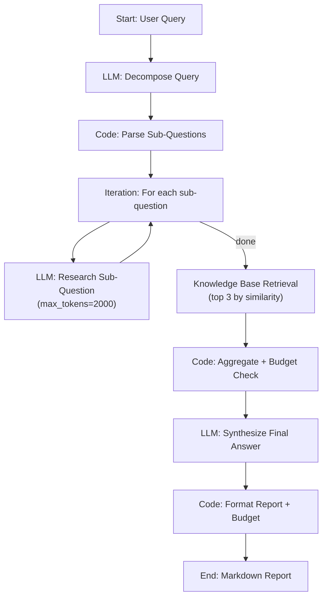

# G3: Deep Research Agent + Memory Constraints

A research agent that answers complex, multi-part queries while operating under strict memory and token constraints. Built entirely as a **Dify workflow** — no external services required. Import one YAML file and it works.

## Architecture



### How It Works

1. **Decompose** — an LLM breaks a complex query into up to 5 independent sub-questions (returned as a JSON array).
2. **Parse** — a Code node extracts the sub-question array and enforces the max-5 limit.
3. **Iterate + Research** — each sub-question is answered by an LLM with `max_tokens=2000`, enforcing the per-subquery budget at the model level.
4. **Knowledge Base Retrieval** — the original query is searched against a vector Knowledge Base (Dify's built-in KB with embedding + cosine similarity). Top 3 relevant chunks are retrieved.
5. **Aggregate + Budget** — a Code node combines all research results *and* KB retrieval results into a unified `[Source N]` / `[KB: title]` context block, counts approximate tokens (`chars / 4`), and truncates if the 10,000-token session budget is exceeded.
6. **Synthesize** — an LLM produces a comprehensive, cited final answer from the aggregated context.
7. **Format** — a Code node merges the answer with a constraint/budget summary table.

### Memory Architecture: Hybrid (LLM Research + Vector RAG)

The agent uses a **two-source** memory strategy:

| Source | Type | How It Works |
|---|---|---|
| LLM Research (per sub-question) | Parametric knowledge | Each sub-question answered by an LLM within a 2,000-token budget |
| Knowledge Base Retrieval | Vector RAG | Original query searched against an embedded document store; top-K chunks retrieved by cosine similarity |

Both sources are combined into a single context block and subject to the same 10,000-token session budget. This hybrid approach provides both breadth (LLM parametric knowledge) and depth (domain-specific documents from the KB).

### Self-Defined Constraints

| Constraint | How Enforced | Default |
|---|---|---|
| Max tokens per sub-query | `max_tokens` parameter on the Research LLM node | 2,000 |
| Max tokens per session | Code node truncates aggregated context if over budget | 10,000 |
| Max sub-questions | Decompose prompt instruction + Code node `[:5]` slice | 5 |
| KB retrieval chunks | `top_k` parameter on Knowledge Base Retrieval node | 3 |

All constraints are visible and editable directly in the Dify workflow editor.

## Tech Stack

| Component | Tool |
|---|---|
| Orchestration | [Dify](https://dify.ai) (self-hosted, workflow mode) |
| LLM | Any OpenAI-compatible model (HKBU GenAI API / OpenAI / etc.) |
| Vector Retrieval | Dify Knowledge Base (embedding + cosine similarity) |
| Query Decomposition | LLM node with JSON output prompt |
| Token Counting | Approximation in Code node (`len(text) // 4`) |
| Budget Enforcement | Code node with truncation logic |
| Output Formatting | Code node generating Markdown with budget table |

## Quick Start

### Prerequisites

- Docker & Docker Compose
- An API key: **OpenAI** or **HKBU GenAI API** (either one is sufficient)

### 1. Start Dify

```bash
git clone https://github.com/langgenius/dify.git
cd dify/docker
cp .env.example .env
docker compose up -d
```

### 2. Configure

```bash
cp .env.example .env
# Edit .env — fill in your API keys and choose LLM_PROVIDER (openai or hkbu)
```

### 3. Run setup

```bash
./setup.sh
```

**Zero interactive prompts** — everything is read from `.env`. The script:
1. Registers a Dify admin account (first run only)
2. Installs model provider plugins from the Dify Marketplace
3. Configures LLM + embedding credentials (OpenAI or HKBU — single key covers both)
4. Creates a Knowledge Base and uploads sample documents
5. Waits for vector indexing to complete
6. Patches and imports the workflow (correct KB ID + model references)

<details>
<summary>Manual setup (if you prefer)</summary>

See [`dify/SETUP_GUIDE.md`](dify/SETUP_GUIDE.md) for step-by-step manual instructions.

</details>

### 4. Test

Open the workflow URL printed by the setup script → **Debug & Preview** → enter a query:

> Compare the economic impact of AI regulation in the EU vs the US. What are the key differences, and how might they affect tech startups?

## Project Structure

```
binox-interview/
├── README.md                          # This file
├── evaluation.md                      # Architecture trade-off analysis
├── setup.sh                           # Automated setup (reads from .env)
├── .env.example                       # Configuration template
├── .gitignore
├── dify/
│   ├── research-agent.yml             # Dify workflow DSL (import into Dify)
│   ├── SETUP_GUIDE.md                 # Step-by-step Dify configuration
│   └── sample_knowledge/              # Documents for the Knowledge Base
│       ├── eu_ai_act_overview.txt     # EU AI Act provisions and risk tiers
│       ├── us_ai_policy.txt           # US AI regulatory landscape
│       └── ai_startup_impact.txt      # Impact on tech startups
└── examples/
    ├── demo_output.md                 # Sample workflow output
    ├── test_results.md                # 10-query test suite results
    └── recordings/                    # Screen recordings of each test (local only)
```

## Workflow Nodes

| Node | Type | Purpose |
|---|---|---|
| Start | start | Accept user query (text, max 2000 chars) |
| Decompose Query | LLM | Break query into up to 5 sub-questions |
| Parse Sub-Questions | Code | Extract JSON array, enforce max-5 |
| Research Each Sub-Question | Iteration + LLM | Answer each sub-question (`max_tokens=2000`) |
| Knowledge Base Retrieval | knowledge-retrieval | Vector similarity search (top 3 chunks) |
| Aggregate + Budget | Code | Combine research + KB results, count tokens, truncate if over 10K |
| Synthesize Answer | LLM | Produce final cited answer from combined context |
| Format Report | Code | Merge answer with budget summary table |
| End | end | Output Markdown report |

## Demo

### Demo Scenario

**Query:**
> "Compare the economic impact of AI regulation in the EU (AI Act) vs the US approach. What are the key differences in enforcement mechanisms, and how might they affect tech startups operating in both markets?"

**Expected flow:**
1. Decomposes into ~4 sub-questions (EU AI Act provisions, US approach, enforcement differences, startup impact).
2. Each sub-question researched by LLM with 2,000-token limit.
3. Knowledge Base searched for relevant document chunks (EU AI Act overview, US policy, startup impact).
4. Research results + KB chunks aggregated and checked against 10,000-token session budget.
5. Final synthesis with `[Source N]` and `[KB: title]` citations.
6. Markdown report with budget summary table showing tokens used vs. limits.

See [`examples/demo_output.md`](examples/demo_output.md) for sample output.

### Screen Recordings

**Test 1 — "Compare AI regulation in the EU vs US. How might it affect tech startups?"**
All 3 KB documents retrieved (EU AI Act, US policy, startup impact). Full decomposition + synthesis with citations.


**Test 4 — "Explain the biochemistry of photosynthesis and its role in the carbon cycle."**
0 KB documents retrieved (score threshold filters out irrelevant AI regulation docs). Agent falls back to LLM-only research.


**Test 10 — "Should a Hong Kong-based AI startup expand to the EU or US market first?"**
3 KB documents retrieved. Agent synthesises a decision-oriented recommendation with cited evidence.


### Test Suite (10 Queries)

All 10 test queries passed (10/10). The suite covers diverse scenarios:

| Query Type | KB Docs Retrieved | Tests |
|---|---|---|
| AI regulation (matches KB) | 3 | Decomposition, citation, hybrid retrieval |
| Unrelated topics (no KB match) | 0 | Score threshold, graceful fallback to LLM-only |
| Partially related | 2 | Hybrid value (LLM fills KB gaps) |
| Max complexity (5+ sub-questions) | 2 | Budget limits, constraint enforcement |

See [`examples/test_results.md`](examples/test_results.md) for full results with actual outputs.

## Self-Assessment

### Strengths
- **Vector RAG + LLM research**: combines parametric knowledge with domain-specific document retrieval, satisfying the "retrieval of relevant context" criterion.
- **Zero-setup prototype**: import one YAML file into Dify, create a KB, and it works — no external services, no Docker builds, no API servers.
- **Visible constraint enforcement**: all budget parameters are editable directly in the Dify workflow editor.
- **Clear decomposition**: the workflow structure mirrors the conceptual architecture exactly.
- **Reproducible**: the entire agent is captured in a single version-controlled YAML file with sample documents.
- **Appropriate tool selection**: Dify was recommended in the brief; this implementation uses it fully, including its native Knowledge Base for vector retrieval.
- **Clear business value**: at ~$0.01 per research session (~200x faster, ~1,000x cheaper than manual analyst work), the agent demonstrates tangible ROI for consulting, compliance, and due diligence use cases. See `evaluation.md` Section 8 for the full cost-benefit analysis.

### Limitations
- Token counting uses character-based approximation (`chars / 4`) since the Dify sandbox lacks `tiktoken`. See `evaluation.md` for analysis.
- No live web search — research uses LLM parametric knowledge. A production version would add a web search tool node.
- KB requires one-time manual setup (create KB, upload documents, link to workflow). This is inherent to Dify's design.
- Budget enforcement is post-hoc (after iteration), not per-step (mid-iteration early stopping). Dify iteration nodes don't natively support conditional break.

### Future Improvements
- Add a Dify Tool node for web search (Tavily, SearXNG) to ground answers in real-time data.
- Use Dify's Agent mode for dynamic tool selection (search vs. knowledge base vs. LLM).
- Implement per-step budget enforcement using Dify conversation variables + variable assigner for early stopping.
- Add more documents to the KB for broader domain coverage.
