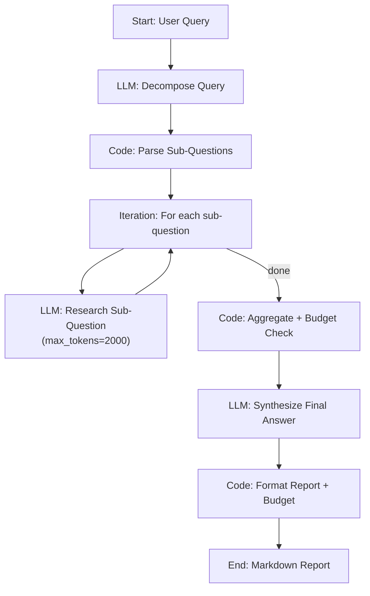

# G3: Deep Research Agent + Memory Constraints

A research agent that answers complex, multi-part queries while operating under strict memory and token constraints. Built entirely as a **Dify workflow** — no external services required. Import one YAML file and it works.

## Architecture



### How It Works

1. **Decompose** — an LLM breaks a complex query into up to 5 independent sub-questions (returned as a JSON array).
2. **Parse** — a Code node extracts the sub-question array and enforces the max-5 limit.
3. **Iterate + Research** — each sub-question is answered by an LLM with `max_tokens=2000`, enforcing the per-subquery budget at the model level.
4. **Aggregate + Budget** — a Code node combines all research results into a `[Source N]` context block, counts approximate tokens (`chars / 4`), and truncates if the 10,000-token session budget is exceeded.
5. **Synthesize** — an LLM produces a comprehensive, cited final answer from the aggregated research context.
6. **Format** — a Code node merges the answer with a constraint/budget summary table.

### Self-Defined Constraints

| Constraint | How Enforced | Default |
|---|---|---|
| Max tokens per sub-query | `max_tokens` parameter on the Research LLM node | 2,000 |
| Max tokens per session | Code node truncates aggregated context if over budget | 10,000 |
| Max sub-questions | Decompose prompt instruction + Code node `[:5]` slice | 5 |

All constraints are visible and editable directly in the Dify workflow editor.

## Tech Stack

| Component | Tool |
|---|---|
| Orchestration | [Dify](https://dify.ai) (self-hosted, workflow mode) |
| LLM | Any OpenAI-compatible model (HKBU GenAI API / OpenAI / etc.) |
| Query Decomposition | LLM node with JSON output prompt |
| Token Counting | Approximation in Code node (`len(text) // 4`) |
| Budget Enforcement | Code node with truncation logic |
| Output Formatting | Code node generating Markdown with budget table |

## Quick Start

### Prerequisites

- Docker & Docker Compose (for Dify)
- An LLM API key

### 1. Start Dify

```bash
git clone https://github.com/langgenius/dify.git
cd dify/docker
cp .env.example .env
docker compose up -d
```

### 2. Add a model provider

In Dify Settings, add your LLM (OpenAI, HKBU GenAI API, etc.).
See [`dify/SETUP_GUIDE.md`](dify/SETUP_GUIDE.md) for detailed steps.

### 3. Import the workflow

Go to **Studio** → **Create from DSL** → upload [`dify/research-agent.yml`](dify/research-agent.yml).

### 4. Test

Open the workflow → **Debug & Preview** → enter a query:

> Compare the economic impact of AI regulation in the EU vs the US. What are the key differences, and how might they affect tech startups?

## Project Structure

```
binox-interview/
├── README.md                  # This file
├── evaluation.md              # Architecture trade-off analysis
├── .gitignore
├── dify/
│   ├── research-agent.yml     # Dify workflow DSL (import into Dify)
│   └── SETUP_GUIDE.md         # Step-by-step Dify configuration
└── examples/
    └── demo_output.md         # Sample workflow output
```

## Workflow Nodes

| Node | Type | Purpose |
|---|---|---|
| Start | start | Accept user query (text, max 2000 chars) |
| Decompose Query | LLM | Break query into up to 5 sub-questions |
| Parse Sub-Questions | Code | Extract JSON array, enforce max-5 |
| Research Each Sub-Question | Iteration + LLM | Answer each sub-question (`max_tokens=2000`) |
| Aggregate + Budget | Code | Combine results, count tokens, truncate if over 10K budget |
| Synthesize Answer | LLM | Produce final cited answer from research context |
| Format Report | Code | Merge answer with budget summary table |
| End | end | Output Markdown report |

## Demo

### Demo Scenario

**Query:**
> "Compare the economic impact of AI regulation in the EU (AI Act) vs the US approach. What are the key differences in enforcement mechanisms, and how might they affect tech startups operating in both markets?"

**Expected flow:**
1. Decomposes into ~4 sub-questions (EU AI Act provisions, US approach, enforcement differences, startup impact).
2. Each sub-question researched by LLM with 2,000-token limit.
3. Results aggregated and checked against 10,000-token session budget.
4. Final synthesis with `[Source N]` citations.
5. Markdown report with budget summary table showing tokens used vs. limits.

See [`examples/demo_output.md`](examples/demo_output.md) for sample output.

## Self-Assessment

### Strengths
- **Zero-setup prototype**: import one YAML file into Dify and it works — no external services, no Docker builds, no API servers.
- **Visible constraint enforcement**: all budget parameters are editable directly in the Dify workflow editor.
- **Clear decomposition**: the workflow structure mirrors the conceptual architecture exactly.
- **Reproducible**: the entire agent is captured in a single version-controlled YAML file.
- **Appropriate tool selection**: Dify was recommended in the brief; this implementation uses it fully.

### Limitations
- Token counting uses character-based approximation (`chars / 4`) since the Dify sandbox lacks `tiktoken`. See `evaluation.md` for analysis.
- No live web search — research uses LLM parametric knowledge. A production version would add a web search tool node.
- No vector storage / RAG — research results are passed through the workflow graph, not stored in a persistent vector DB. Sufficient for the prototype but not for cross-session memory.
- Budget enforcement is post-hoc (after iteration), not per-step (mid-iteration early stopping). Dify iteration nodes don't natively support conditional break.

### Future Improvements
- Add a Dify Tool node for web search (Tavily, SearXNG) to ground answers in real-time data.
- Connect a Dify Knowledge Base for persistent cross-session memory.
- Use Dify's Agent mode for dynamic tool selection (search vs. knowledge base vs. LLM).
- Implement per-step budget enforcement using Dify conversation variables + variable assigner for early stopping.
