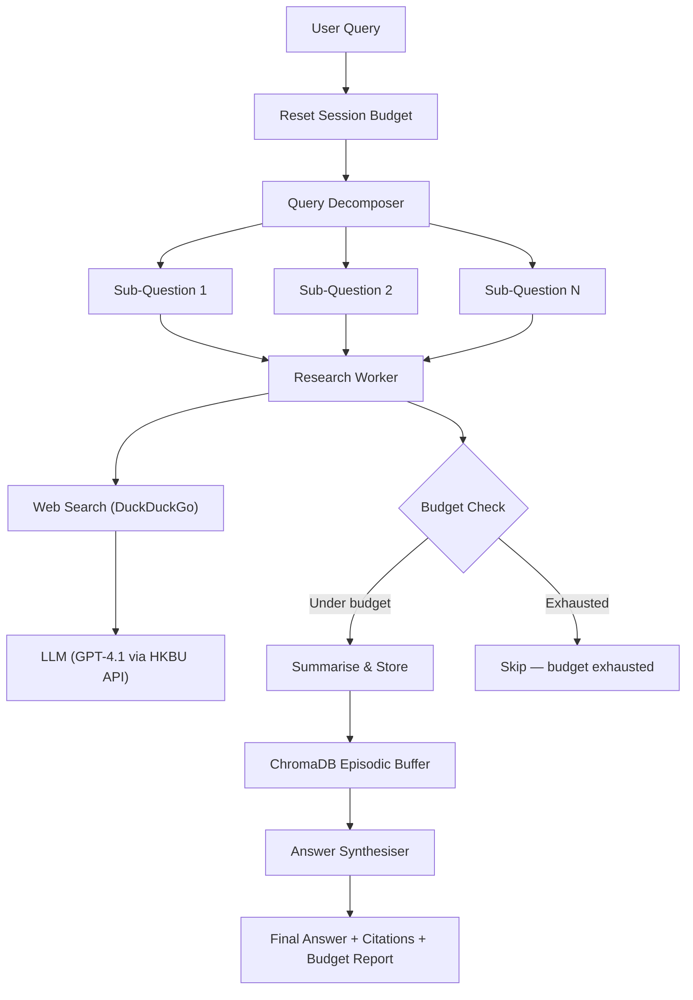

# G3: Deep Research Agent + Memory Constraints

A research agent that answers complex, multi-part queries while operating under strict memory and token constraints. Built with a **Python FastAPI** memory service that enforces a **summarisation cascade** strategy, **DuckDuckGo web search** for real-time grounding, and **Dify** for visual workflow orchestration.

## Architecture



### How It Works

1. **Decompose** — the LLM breaks a complex query into up to 5 independent sub-questions.
2. **Web Search** — each sub-question is searched on DuckDuckGo to gather real-time sources.
3. **Research** — search results are fed to the LLM as grounding context; the answer is truncated to the per-sub-query token budget and stored in ChromaDB.
4. **Budget enforcement** — after every sub-query the remaining token budget is checked. If exhausted, remaining sub-questions are skipped.
5. **Synthesise** — the most relevant stored summaries are retrieved via vector similarity and fed to the LLM to produce a final, cited answer.
6. **Cost report** — every response includes token usage, budget remaining, and estimated USD cost.

### Self-Defined Constraints

| Constraint | Default | Env Variable |
|---|---|---|
| Max tokens per sub-query | 2 000 | `MAX_TOKENS_PER_SUBQUERY` |
| Max tokens per session | 10 000 | `MAX_TOKENS_PER_SESSION` |
| Max sub-questions | 5 | `MAX_SUBQUESTIONS` |

All constraints are configurable via environment variables (see `.env.example`).

## Tech Stack

| Component | Tool |
|---|---|
| Orchestration | [Dify](https://dify.ai) (workflow mode) |
| LLM | HKBU GenAI API — GPT-4.1 (Azure OpenAI-compatible) |
| Web Search | DuckDuckGo (free, no API key required) |
| Vector Store | ChromaDB (embedded, cosine similarity) |
| Token Counting | tiktoken (`cl100k_base`) |
| Cost Tracking | Per-call token usage + USD estimation |
| Memory Service | Python / FastAPI |
| Deployment | Docker Compose |

## Quick Start

### Prerequisites

- Python 3.11+
- An HKBU GenAI API key (or any OpenAI-compatible endpoint)

### 1. Clone and configure

```bash
git clone <repo-url>
cd binox-interview
cp .env.example .env
# Edit .env and set HKBU_API_KEY
```

### 2. Install dependencies

```bash
python -m pip install -r requirements.txt
```

### 3. Run the CLI demo (fastest way to test)

```bash
# Full pipeline with real LLM + web search
python -m src.cli --demo

# Or provide your own question
python -m src.cli "What are the latest developments in quantum computing?"

# Offline mode — no API key needed, uses mock data
python -m src.cli --offline
```

See [`examples/demo_output.md`](examples/demo_output.md) for sample output.

### 4. Start the memory service (for Dify or API usage)

```bash
uvicorn src.main:app --host 0.0.0.0 --port 8100
```

Or via Docker:

```bash
docker compose up --build -d
```

### 5. Set up Dify (optional — visual orchestration)

Follow the detailed instructions in [`dify/SETUP_GUIDE.md`](dify/SETUP_GUIDE.md). In short:

1. Run Dify locally (`docker compose up` in the Dify repo).
2. Add the HKBU API as an OpenAI-compatible model provider.
3. Import `dify/openapi_tools.json` as a custom tool collection.
4. Import `dify/research-agent.yml` as a workflow.
5. Publish and test.

### 6. Run tests

```bash
python -m pytest tests/ -v
```

## Project Structure

```
binox-interview/
├── README.md                  # This file
├── evaluation.md              # Architecture trade-off analysis
├── docker-compose.yml         # Memory service container
├── Dockerfile
├── requirements.txt
├── .env.example
├── dify/
│   ├── SETUP_GUIDE.md         # Step-by-step Dify configuration
│   ├── research-agent.yml     # Dify workflow DSL (importable)
│   └── openapi_tools.json     # OpenAPI schema for Dify tool import
├── src/
│   ├── main.py                # FastAPI app — all endpoints + pipeline
│   ├── memory.py              # ChromaDB-backed memory manager
│   ├── constraints.py         # Token counting & budget tracking
│   ├── config.py              # Pydantic settings
│   ├── llm.py                 # LLM client with cost tracking
│   ├── search.py              # DuckDuckGo web search integration
│   └── cli.py                 # CLI demo runner
├── tests/
│   ├── test_memory.py         # Unit tests (constraints, storage, API)
│   └── test_demo.py           # End-to-end pipeline test
└── examples/
    └── demo_output.md         # Sample CLI output
```

## API Endpoints

| Method | Path | Purpose |
|---|---|---|
| `GET` | `/health` | Health check |
| `POST` | `/memory/store` | Store a research chunk |
| `POST` | `/memory/retrieve` | Vector-search stored summaries |
| `GET` | `/memory/budget` | Current token usage vs. limits |
| `POST` | `/memory/reset` | Reset session budget + LLM cost tracker |
| `POST` | `/memory/summarize` | LLM-powered text compression |
| `POST` | `/decompose` | Break query into sub-questions |
| `POST` | `/research` | Web search → LLM answer → store (budget-aware) |
| `POST` | `/synthesize` | Retrieve context and produce final answer |
| `POST` | `/pipeline` | **Full pipeline in one call** (decompose → research → synthesise) |

## Demo

### CLI (recommended for quick testing)

```bash
python -m src.cli --demo
```

### API (single request)

```bash
curl -X POST http://localhost:8100/pipeline \
  -H "Content-Type: application/json" \
  -d '{"query": "Compare AI regulation in the EU vs the US and its impact on startups"}'
```

### Demo Scenario

**Query:**
> "Compare the economic impact of AI regulation in the EU (AI Act) vs the US approach. What are the key differences in enforcement mechanisms, and how might they affect tech startups operating in both markets?"

**Expected flow:**
1. Decomposes into ~4 sub-questions (EU AI Act details, US approach, enforcement differences, startup impact).
2. Each sub-question is searched on DuckDuckGo for real-time sources.
3. Search results + LLM knowledge produce answers within the 2 000-token budget.
4. Summaries stored in ChromaDB.
5. Final synthesis pulls the most relevant chunks and produces a cited report.
6. Budget report shows total tokens used stayed under 10 000, with estimated USD cost.

## Self-Assessment

### Strengths
- **Real web search**: DuckDuckGo integration means the agent uses real-time data, not just LLM parametric knowledge.
- **Clear constraint enforcement**: token budgets are tracked precisely with tiktoken and enforced at every step.
- **Cost awareness**: every response includes estimated USD cost, demonstrating production cost-consciousness.
- **Multiple interaction modes**: CLI for quick demos, REST API for integration, Dify for visual orchestration.
- **Modular design**: the memory service is fully decoupled from Dify — it can be reused with any orchestrator.
- **Reproducible**: Docker Compose + Dify DSL export means anyone can spin up the full system.
- **Tested**: unit tests cover constraints, storage, retrieval, and API endpoints; end-to-end demo test available.
- **Offline mode**: `--offline` flag lets reviewers see the pipeline flow without an API key.

### Limitations
- ChromaDB's default embedding model is used; a domain-specific embedding could improve retrieval quality.
- The Dify workflow iteration model is simplified — a production version would add conditional branching on budget exhaustion within the iterator.
- DuckDuckGo has rate limits for automated queries; a production system would use a dedicated search API (Tavily, SearXNG).

### Future Improvements
- Integrate Tavily or SearXNG for more reliable web search.
- Implement cross-session memory (currently each session resets).
- Add streaming responses for long synthesis steps.
- Add an "importance scoring" step that allocates more of the token budget to higher-priority sub-questions.
- Build a simple web UI on top of the pipeline API.
